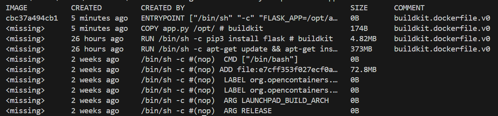

# docker-training
Docker Training Material

Slide: https://docs.google.com/presentation/d/1glqYc4bGakrr3BgmQK3s6gqyHcP9_M0ii6ZS4n8orwk/edit?usp=sharing

Activities to try:
* **Running a docker image:**
    * *docker run nginx* 
    > This will run in attach mode
    * *docker run -d nginx* 
    > This will run in detach mode
    * *docker run -d -p 8000:80 --name my-nginx nginx* 
    > This will map port 8000 on the docker host with port 80 on the container. And, container will be named *my-nginx*
    * *docker run -it nginx* 
    > This will attach the terminal and we can interact with it
    * *docker run -d -v /home/your-user-dir/mysql-data:/var/lib/mysql mysql*
    > This will mount the */var/lib/mysql* folder of mysql to the *mysql-data* folder in your host
    * *docker run -d -e MYSQL_ROOT_PASSWORD=db_pass123 mysql*
    > This will create an env var for mysql password (Details: https://hub.docker.com/_/mysql)

* **List Containers**
    * *docker ps*
    > This lists running containers
    * *docker ps -a*
    > This lists all containers

* **Stop & Remove Containers**
    * *docker stop [container name/id]*
    * *docker rm [container name/id]*

* **List Images**
    * *docker images*

* **Pull Images**
    * *docker pull ubuntu*
    > This will pull the Ubuntu image from docker hub. It will not run the image

* **Remove Images**
    * *docker rmi ubuntu*

* **Execute Commands on Running Container**
    * *docker exec -it [containerId] mysql -u root -p*
    > We had earlier created mysql container and configured password. We can use that password to execute mysql command
    * *docker run ubuntu sleep 5
    > Docker exec can only work for existing container. We can use docker run to execute command on a new container.

    > Above command will run a Ubuntu container, execute sleep command for 5 seconds and then container exits

* **Inspect Resources**
    * *docker inspect [resource name/id]*
    > This is used to get all the details regarding any docker resource, be it container, image, network etc.
    * *docker inspect mysql*
    > This will show details about the mysql docker image
    * *docker inspect 31d3e3e48cbc*
    > This will show details about the container with id *31d3e3e48cbc*
    
    > Run *docker ps -a* to get container id

* **Building Own Docker Image**
    * First we will create a simple flask application, which will simply say Welcome! on the browser. Code is available in *app.py*
    * Now, we will create the Dockerfile. This will use Ubuntu:20.04 as base image. It will install python packages and then will copy app.py to the container. Finally, it runs the flask application. Code is available in *Dockerfile*
    * Now, we will build the docker image out of this Dockerfile. We will run the command: *docker build . -t simple-flask-app*
    * We can check the image is built by running *docker images*
    * Now, we can run this image. We will map the port 8000 with the port 8080, on which flask app is running: *docker run -d -p 8000:8080 simple-flask-app*
    * Finally, we can go to *localhost:8000* and we can see the *Welcome!* message printed

* **Docker Networking**
    * Creating User-defined Networks: *docker network create –-driver bridge -–subnet 182.18.0.0/16 mynet*
    * Network can be attached to a Docker container using *--network* option in *docker run* command:
    *docker run --network mynet nginx*

* **Docker Storage**
    * Docker Image follows layered architecture. We can see this by running *docker history simple-flask-app* command for the *simple-flask-app* image we created.
    
    * Docker by default has ephemeral storage, meaning as soon as the container is exited, all the data is lost. So, to have persistent storage, we can use *-v* option to run a container mounting an external file storage.
        * We will run a new mysql container named *mysql-db*, with the *MYSQL_ROOT_PASSWORD* env var. We will mount our local storage with the mysql data: *docker run -d --name mysql-db -e MYSQL_ROOT_PASSWORD=db_pass123 -v /home/your-user-dir/mysql-data:/var/lib/mysql mysql*
        * We will now login to mysql and create a database: *docker exec -it mysql-db mysql -u root -p*
        Here, *mysql-db* is the container name and *mysql -u root -p* is the command we want to execute.
        * We will enter the password created earlier and then run below command to create database: *create database mydb;*
        * We can run *show databases;* to see the database was created. We can also check this in our *mysql-data* directory
        * Now, we will stop this container and run a new container with same volume mount and see if the data is persisted: 
            * *docker ps -a*
            * *docker stop [containerId]* (Got from above step)
            * *docker rm [containerId]*
            * *docker run -d --name mysql-db -e MYSQL_ROOT_PASSWORD=db_pass123 -v /home/your-user-dir/mysql-data:/var/lib/mysql mysql*
            * *docker exec -it mysql-db mysql -u root -p*
            * *show databases;*

* **Docker Registry**
    * Creating your own local registry: 
        * *docker run -d -p 5000:5000 --name registry registry:2*
    * Pushing image to the registry
        * *docker tag simple-flask-app localhost:5000/simple-flask-app*
        > We will first tag our *simple-flask-app* image to push to local registry 
        * *docker push localhost:5000/simple-flask-ap*
    
    * In some repositories, which are password protected, you may also need to *docker login* first before doing *docker push*
        * Example - *docker login hub.docker.com*

    * We can check the pushed image by curling this location, or running it in browser: *curl -X GET localhost:5000/v2/_catalog*

* **Extra Note**
    * We can run *docker images prune -a* to delete all the images, that are not used by any containers.
    * If we try to delete an image, which is already running a container, it will give error
    * We can run *docker system prune -a* to delete all the unused docker resource which includes images, containers, networks, etc
